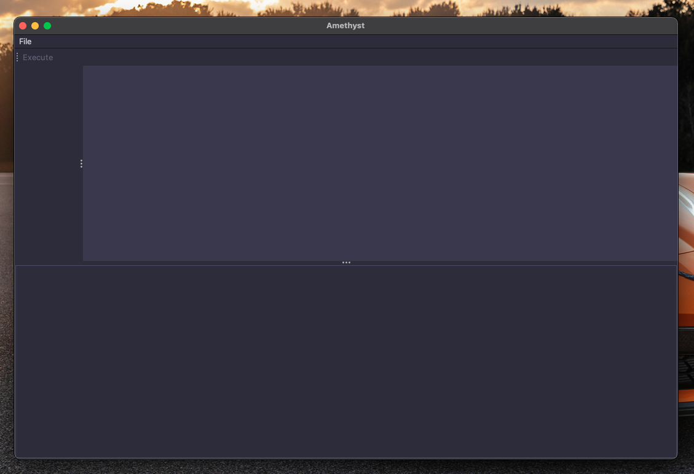
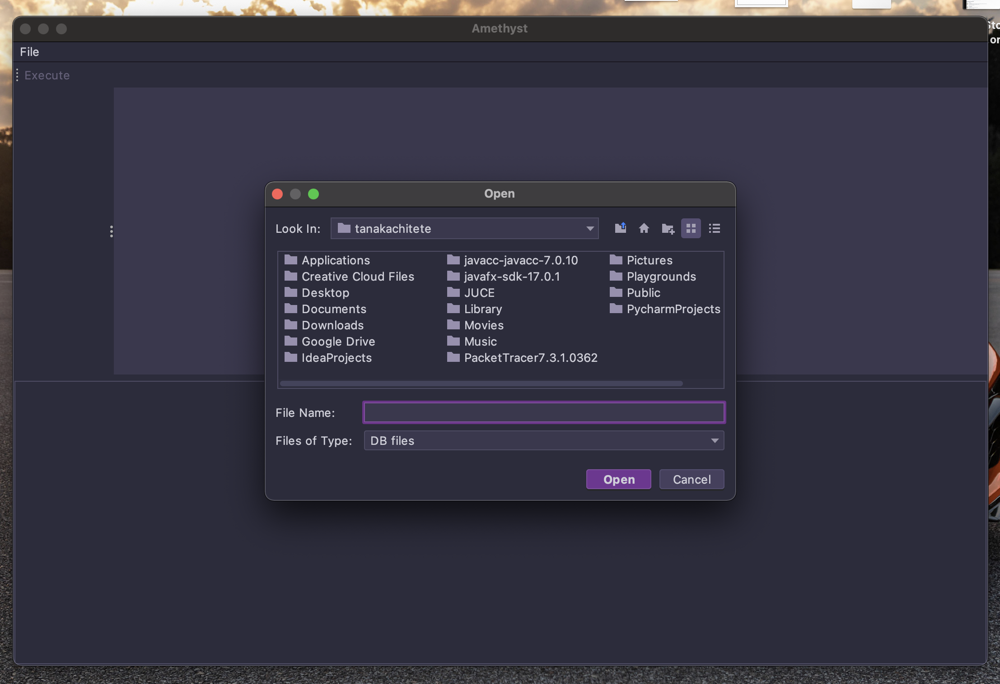
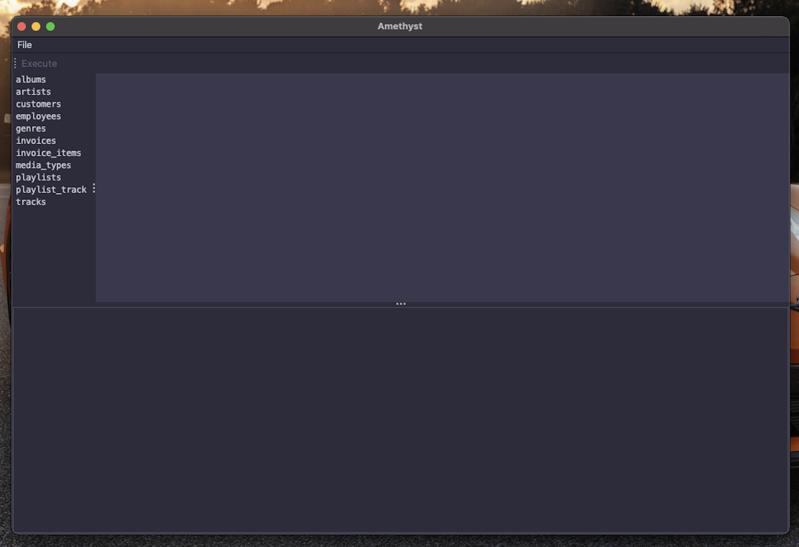
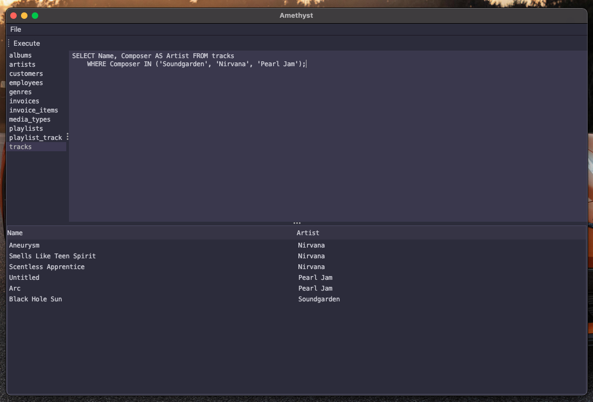

# Amethyst

Amethyst is a Desktop Relational Database Management System (RDMS) written in Java which facilitates the querying of SQLite databases via a desktop GUI.

## Getting Started

### Installation

1. Install the ```amethyst-master``` archive by downloading [```amethyst-master.zip```](https://github.com/tanaka-chitete/amethyst/archive/master.zip)
2. Open a new terminal window in the directory where the archive was downloaded
3. Unzip the archive using the following command to obtain the ```amethyst-master``` directory:
```
unzip amethyst-master.zip
```
4. Change into the ```amethyst-master``` directory by executing the following command:
```
cd amethyst-master
```

### Execution

1. To begin executing ```amethyst```, execute the following:
```
./gradlew run
```
Upon execution, the GUI should load; appearing something like this:



2. To load a database, navigate to File > Open, located in the top left corner of the GUI. After doing so, a file selection window should appear, like so:



3. Locate the `chinook.db` file located in the `amethyst-master` directory and click `Open`. Upon doing so all the available tables in the database will be listed on the left-hand side of the screen, appearing as follows:



4. Select the `tracks` table and enter the following query into the textbox to the right of the tables list:
```
SELECT Name, Composer AS Artist FROM tracks WHERE Composer IN ('Soundgarden', 'Nirvana', 'Pearl Jam');
```

5. Click `Execute`, found above the tables list to execute the query. The results should be as follows:



6. Execute other queries using the tables found in `chinook.db` or those found in other databases if you wish!

7. Once finished, exit the application by clicking the exit icon found in the top left corner of the GUI.

### Restoration

* To restore the ```amethyst-master``` directory back to its original state, execute the following command:
```
./gradlew clean
```

## Author

Tanaka Chitete
* [Linkedin](https://www.linkedin.com/in/tanaka-chitete/)

## Acknowledgments

* Thank you to [DomPizzie](https://github.com/DomPizzie) for the [template](https://gist.github.com/DomPizzie/7a5ff55ffa9081f2de27c315f5018afc)
